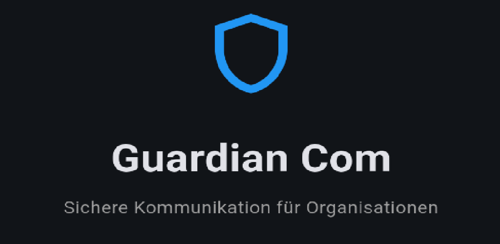
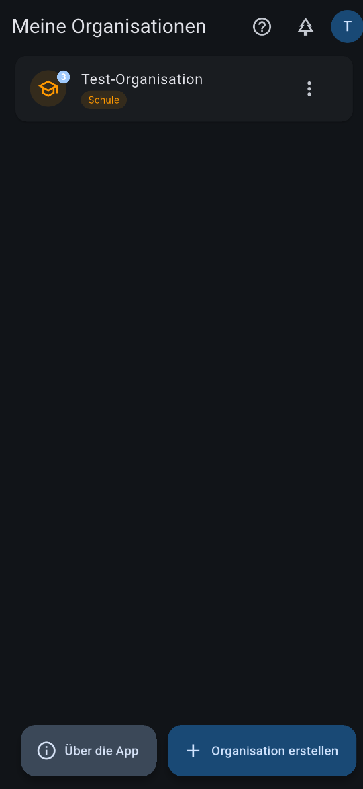
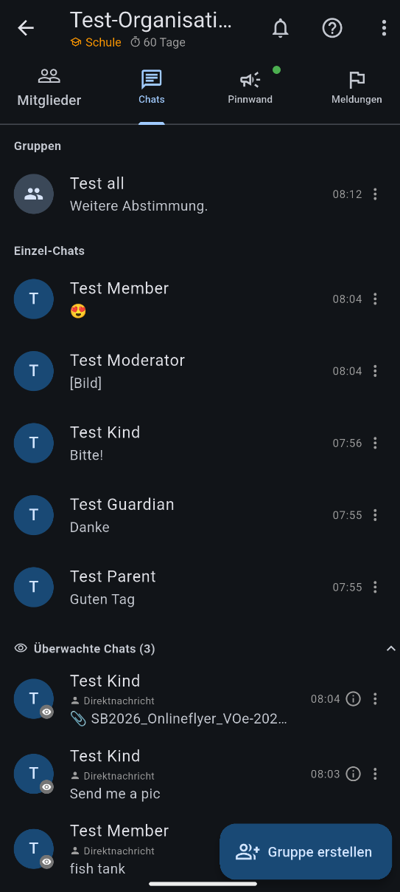
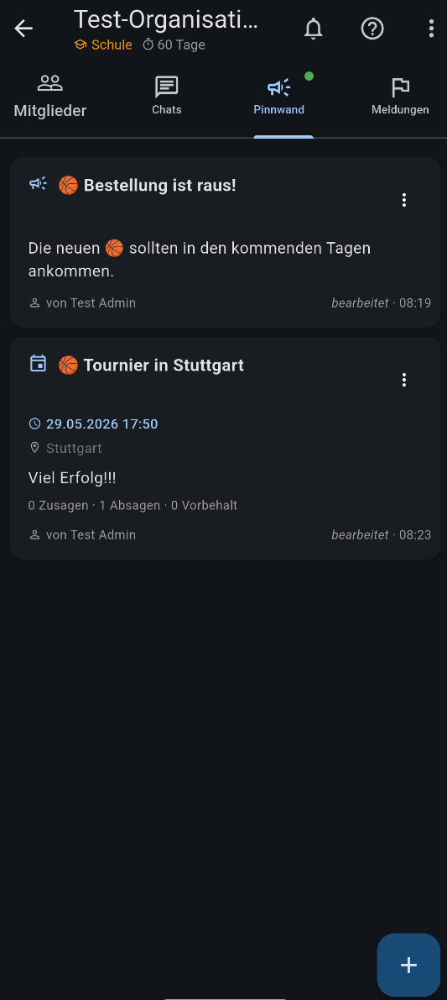
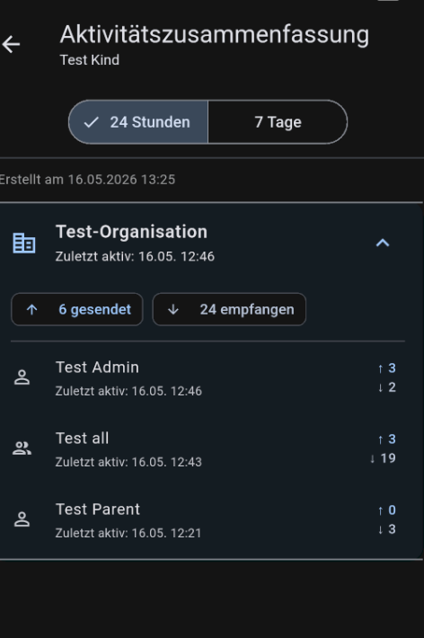
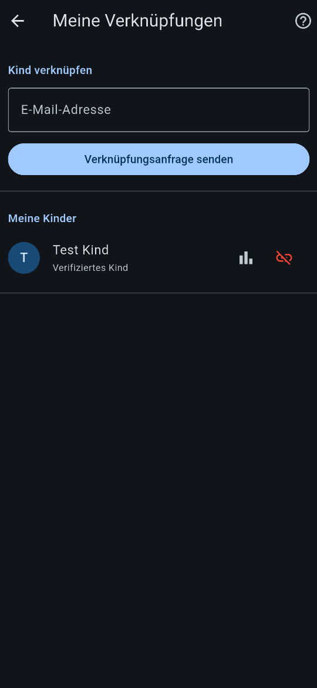

# Guardian App

[](LICENSE)
[](https://flutter.dev)
[](https://appwrite.io)
[](https://firebase.google.com)
[](#builds)

Eine Flutter-App für sichere, überwachte Kommunikation zwischen Kindern, Erziehungsberechtigten und Organisationen.

Diese App wurde vollständig durch vibe-coding generiert.
Dazu wurde ClaudeCode verwendet um meine Vorstellungen in eine App zu gießen.

---

## Screenshots

<table>
  <tr>
    <td align="center"><br/><sub>Startbildschirm</sub></td>
    <td align="center"><br/><sub>Organisationen</sub></td>
    <td align="center"><br/><sub>Chat-Übersicht</sub></td>
  </tr>
  <tr>
    <td align="center"><br/><sub>Pinnwand</sub></td>
    <td align="center"><br/><sub>Aktivitätszusammenfassung</sub></td>
    <td align="center"><br/><sub>Meine Verknüpfungen</sub></td>
  </tr>
</table>

---

## Technologie

| Bereich | Stack |
|---|---|
| **Frontend** | Flutter 3.x (Dart) |
| **Authentifizierung & Dateiablage** | Appwrite (self-hosted) |
| **Datenbank, Push & Fehlerberichte** | Firebase (Firestore, FCM, Crashlytics, App Check) |
| **State Management** | Riverpod 3.x |
| **Navigation** | GoRouter |
| **Anmeldemethoden** | Google Sign-In (Android), E-Mail-Code/OTP (Android, Windows) |
| **Cloud Functions** | Node.js 22 (Benachrichtigungen, E-Mail-Einladungen) |

---

## Funktionsübersicht

### Authentifizierung
- **Google Sign-In** (Android)
- **E-Mail-Code (passwortlos):** Nutzer gibt E-Mail ein → erhält 6-stelligen Code per E-Mail → Code direkt in der App eingeben. Kein Passwort, kein Browser-Wechsel nötig. Funktioniert auf Android und Windows.
- **Google-Konto verknüpfen:** Im Profil kann ein bestehendes Konto nachträglich mit Google verknüpft werden, um künftig per Google-Login einzusteigen
- Automatische Benutzerprofil-Erstellung bei der ersten Anmeldung
- Pre-Registrierung: Einladungen werden beim ersten Login automatisch verarbeitet, sodass Rollen sofort aktiv sind

### Organisationen
- Organisationen erstellen mit Name und Kategorie (Familie, Freunde, Schule, Vereine, Sonstiges)
- Namen sind auf 40 Zeichen begrenzt
- Mitglieder per E-Mail einladen mit Rollenzuweisung
- **Adressbuch:** Beim Einladen können Mitglieder aus anderen Organisationen des Admins/Moderators direkt ausgewählt werden (ohne erneute E-Mail-Eingabe) — dedupliziert, mit Rollen- und Guardian-Auswahl
- **Bulk-Import:** Mehrere Mitglieder gleichzeitig per CSV-Datei importieren
- **Automatische Einladungs-E-Mail** an noch nicht registrierte Nutzer (via Gmail SMTP + Cloud Function)
- **Pre-Registrierung:** Einladung für noch nicht registrierte Nutzer — beim ersten Login erhalten sie automatisch die richtige Rolle
- Organisation bearbeiten (Name und Kategorie)
- Organisation archivieren (read-only) oder dauerhaft löschen
- Admin-Rolle auf ein anderes Mitglied übertragen
- Aus einer Organisation austreten (nicht für Admins)
- Versionsnummer mit Build-Nummer in der Organisations-Übersicht

#### Rollen
| Rolle | Beschreibung |
|---|---|
| **Admin** | Volle Kontrolle über die Organisation |
| **Moderator** | Kann Chats einsehen, genehmigen und verwalten |
| **Mitglied** | Normales Mitglied, kann Chats anfordern |
| **Kind** | Eingeschränktes Mitglied, benötigt einen Guardian |

- Rollenänderung auf **Kind** öffnet direkt die Guardian-Auswahl (nur möglich wenn das Mitglied kein Guardian eines anderen Kindes ist)
- Die Rolle eines Kind-Mitglieds ist unveränderlich — „Rolle ändern" wird für Kinder nicht angeboten
- Guardians eines Kindes können ihre Rolle ändern (z. B. zu Moderator), erhalten aber „Kind" nicht als Zieloption

### Chat-Modi

Jede Organisation unterstützt beide Chat-Typen gleichzeitig — kein separater Modus-Schalter bei der Erstellung mehr nötig.

#### Chat-Anfragen (1-zu-1 & Gruppen auf Anfrage)
- Mitglieder können Chats mit anderen Mitgliedern anfordern
- Admin oder Moderator genehmigt oder lehnt Anfragen ab
- Abgelehnte Anfragen werden gelöscht → neue Anfrage jederzeit möglich
- Nach Chat-Löschung kann ebenfalls eine neue Anfrage gestellt werden
- Genehmigte Chats sind für den Guardian des Kindes sichtbar
- **Chat-Übersicht:** „Überwachte Chats" blendet Chats aus, in denen man selbst Mitglied ist (keine Doppeleinträge); Sektion ist ein- und ausklappbar
- **Chat-Info (ⓘ):** Guardians, Eltern, Admins und Moderatoren können in der Kachel eines überwachten Chats auf ⓘ tippen, um Teilnehmer und Supervisoren des Chats anzuzeigen
- **Typ-Indikator:** Jede Kachel in der „Überwachte Chats"-Liste zeigt „Gruppe" oder „Direktnachricht", damit Gruppen- und 1-zu-1-Chats auf einen Blick unterscheidbar sind
- „Chat Starten" aus der Mitgliederliste öffnet immer einen eigenen 1-zu-1-Chat, auch wenn bereits eine Gruppenkonversation mit derselben Person existiert

#### Admin-verwaltete Gruppen
- Admins können Gruppen-Chats anlegen und Mitglieder direkt zuweisen
- Moderatoren haben Einsicht in alle Chats der Organisation
- **Gruppen umbenennen:** Admins und Moderatoren können Gruppenkonversationen jederzeit umbenennen — über das ✏️-Icon in der AppBar oder das `⋮`-Menü der Chat-Kachel
- **Gruppenbild:** Admins und Moderatoren können ein Bild für eine Gruppenkonversation festlegen — erscheint als Avatar in Kachel und Chat-Header; kann jederzeit geändert oder entfernt werden
- **Persönlicher Chatname:** Jeder Teilnehmer eines Direktchats kann für sich einen eigenen Anzeigenamen vergeben (nur für ihn sichtbar) — per ✏️-Icon in der AppBar, `⋮`-Menü oder Long-Press auf die Chat-Kachel
- **Abstimmungen/Umfragen** können in allen Gruppenkonversationen gestartet werden (Einzel- oder Mehrfachauswahl)

### Guardian-Kind-Beziehung (Org-lokal)
- Kind-Mitglieder werden einem oder mehreren Guardians innerhalb der Organisation zugewiesen
- Guardian muss die Einladung seines Kindes bestätigen
- Guardian-Kind-Beziehung wird in der Mitgliederliste mit Symbol angezeigt
- Guardian hat Lesezugriff auf die Chats seines Kindes
- Wird ein Guardian nachträglich einem Kind zugewiesen, propagiert eine Cloud Function die Änderung automatisch in alle bestehenden Chats des Kindes

### Verifizierte Eltern-Kind-Verknüpfung (konto-übergreifend)

Eltern und Kinder können eine **globale, organisationsunabhängige** Verknüpfung aufbauen, die sicherheitskritische Funktionen für alle Organisationen aktiviert.

#### Prozess

| Schritt | Wer | Was passiert |
|---|---|---|
| **1. Anfrage senden** | Elternteil | Öffnet *Profil → Meine Verknüpfungen*, gibt E-Mail des Kindes ein → `ClaimRequest` wird erstellt (7 Tage gültig), Kind erhält Push-Benachrichtigung |
| **2. Anfrage bestätigen** | Kind | Sieht eingehende Anfrage in *Meine Verknüpfungen*, bestätigt oder lehnt ab |
| **3. Verknüpfung aktiv** | System | Cloud Function aktualisiert beide Konten (`verifiedParentUids` / `verifiedChildUids`), Elternteil erhält Bestätigungs-Push |
| **4. Verknüpfung aufheben** | Elternteil | Nur Elternteile können die Verbindung trennen — Kinder haben kein Recht zur Aufhebung |

#### Org-Einladung eines verknüpften Kindes

Sobald ein Kind verifizierte Eltern hat, wird eine direkte Org-Einladung **blockiert** und ein Einwilligungsprozess gestartet:

1. Admin lädt Kind in eine Organisation ein
2. Statt direktem Beitritt: `OrgInviteConsent`-Dokument wird angelegt
3. **Alle** verifizierten Eltern erhalten eine Push-Benachrichtigung
4. Eltern sehen die ausstehende Einwilligung unter *Meine Verknüpfungen*

**Genehmigung:** Ein einziges Elternteil genügt → Kind wird mit Status `pending` hinzugefügt (Guardian muss danach noch separat bestätigen)  
**Veto:** Jedes Elternteil kann alleine ablehnen → Einladung wird verworfen, Admin erhält Benachrichtigung

#### Rollenschutz für Kind-Konten

- Konten mit `isChild: true` können ausschließlich die Rolle **Kind** in Organisationen innehaben
- Rollenänderungen auf Admin/Moderator/Mitglied werden blockiert (`child_account_role_locked`)
- Kind-Konten können keine neuen Organisationen erstellen

### Meine Verknüpfungen (Profil-Bereich)

Erreichbar über **Profil → Meine Verknüpfungen**. Der Screen vereint alle Aspekte der konto-übergreifenden Eltern-Kind-Verwaltung:

- **Eingehende Anfragen** (Kind-Ansicht): Anfragen von Elternteilen bestätigen oder ablehnen
- **Ausgehende Anfragen** (Eltern-Ansicht): aktive Anfragen einsehen und zurückziehen
- **Kind verknüpfen**: E-Mail des Kindes eingeben und Anfrage senden
- **Meine Kinder / Meine Eltern**: Liste der verifizierten Verbindungen mit Möglichkeit zur Aufhebung
- **Aktivitätszusammenfassung**: Eltern können pro Kind eine Zusammenfassung der Chat-Aktivität der letzten 24 Stunden oder 7 Tage abrufen — Anzahl gesendeter und empfangener Nachrichten je Organisation und Chat, mit Zeitstempel der letzten Aktivität
- **Ausstehende Einwilligungen**: Org-Einladungen für eigene Kinder genehmigen oder ablehnen
- Verifizierte Verbindungen werden in der Mitgliederliste der Organisation mit `🏡`-Symbol angezeigt

### Chat-Funktionen
- Textnachrichten senden
- **Emoji-Picker** — 😊-Button in der Eingabeleiste öffnet einen Emoji-Picker; wechselt per ⌨️ zurück zur System-Tastatur
- **GIF-Rendering** — GIF-URLs werden direkt als animiertes Bild im Chat angezeigt
- **URLs und E-Mail-Adressen** in Nachrichten sind anklickbar
- **Eigene Nachrichten bearbeiten** (per Langer Druck → Bearbeiten)
- **Eigene Nachrichten löschen** (per Langer Druck → Löschen) — für alle anderen erscheint ein Platzhalter; das Löschen kann jederzeit rückgängig gemacht werden. Admins und Moderatoren sehen den Originalinhalt gelöschter Nachrichten (markiert), können sie aber nicht moderieren solange sie gelöscht sind.
- **Text in Zwischenablage kopieren** (per Langer Druck → Kopieren)
- Bearbeitete Nachrichten von Admin/Moderator werden automatisch archiviert (Moderations-Log)
- Bilder senden (JPEG, max. 2 MB, automatisch komprimiert)
- **Bild antippen** öffnet Vollbild-Ansicht mit Pinch-to-Zoom und Speicher-Button (lokale Ordnerauswahl)
- Bilder im Chat werden zwischengespeichert (keine Laderuckler beim Scrollen)
- Sprachnachrichten aufnehmen und abspielen (AAC/Opus, max. 10 MB)
- **Dateien senden** (max. 5 MB, beliebige Dateitypen) — per „+"-Menü im Chat
- **Abstimmungen** in Gruppen-Chats erstellen und abstimmen
- **Tipp-Indikator** — „schreibt gerade…" in Echtzeit über der Eingabeleiste, mit animierten Punkten
- **Nachrichten-Reaktionen** — per langem Druck Emoji-Reaktion wählen (👍❤️😂😮😢😡👎), Reaktionen erscheinen als Chips unter der Nachricht; erneutes Antippen entfernt die eigene Reaktion
- **Antworten auf Nachrichten** (Reply-Zitat in der Blase)
- **Chat-Schriftgröße** einstellbar im Profil (Klein / Mittel / Groß / Sehr groß)
- Scrollbar an der rechten Seite
- Ältere Nachrichten automatisch nachladen beim Hochscrollen
- **Nachrichten anpinnen** — Admin/Moderator kann eine Nachricht anpinnen; wird als Banner oben im Chat angezeigt
- **Geplante Nachrichten** — Nachricht für einen späteren Zeitpunkt planen
- **Abstimmungen (Polls)** — Frage mit Optionen erstellen (Einzel- oder Mehrfachauswahl), optionale Anonymisierung; Abstimmungsergebnisse mit Wähler-Namen (bei nicht-anonymen Umfragen); optionales Ablaufdatum mit Uhrzeit — abgelaufene Umfragen schließen automatisch
- **System-Nachrichten** — in Gruppen-Chats erscheint beim Hinzufügen oder Entfernen von Mitgliedern eine zentrierte, graue Info-Zeile im Chatverlauf

### Chat-Verwaltung (Admin & Moderator)
- Chats archivieren (werden read-only)
- Chats dauerhaft löschen (inkl. aller Nachrichten)
- Ausstehende Chat-Anfragen genehmigen oder ablehnen
- **Geplante Nachrichten** können auch von Admins/Moderatoren geplant werden, die nicht direkte Chat-Teilnehmer sind

### Ungelesene Nachrichten
- Badge-Anzeige auf Chat-Kacheln
- Badge auf dem Chats-Tab mit Unterscheidung: rot (ausstehende Anfragen) / blau (ungelesene Nachrichten)
- Badge auf Organisations-Karten im Startbildschirm

### Push-Benachrichtigungen

#### Android (FCM)
- Benachrichtigung bei neuer Nachricht in genehmigten Chats
- Benachrichtigung bei neuer Chat-Anfrage (Guardian-Modus) — für Approver, Guardian und Angefragten
- Foreground & Background: native System-Benachrichtigung
- **Tap auf Benachrichtigung öffnet direkt den Chat** — auch wenn die App geschlossen war (robustes Deep-Link-Handling via Pending-Message-Pattern, kein fragiles Timeout mehr)
- **Zuverlässige Zustellung (Doze-Modus):** FCM-Nachrichten werden mit `android.priority: high` versendet, sodass Android den Doze-Modus überbrückt und Benachrichtigungen auch nach Stunden ohne Aktivität ankommen
- **FCM-Token-Erneuerung nach Kaltstart:** Token wird bei jedem Login neu registriert, damit keine veralteten Token zu Benachrichtigungsausfällen führen
- **Akku-Optimierungs-Hinweis**: beim Start wird geprüft, ob Android Doze/Akku-Optimierung aktiv ist; ein Dialog erklärt das Problem und leitet direkt zur Systemeinstellung weiter — „Nicht mehr fragen" unterdrückt den Hinweis dauerhaft
- Benachrichtigungsintervall global und pro Organisation einstellbar:
  - Jede Nachricht
  - Max. 1x pro Stunde
  - Max. 1x pro Tag
  - Nie

#### Windows (Firestore-Listener)
- Echtzeit-Listener auf alle genehmigten Chats
- Native Windows Toast-Benachrichtigung bei neuer Nachricht
- Tap auf Toast navigiert direkt zum Chat
- **Tray-Icon** mit Rechtsklick-Menü (Öffnen / Beenden)
- **Tray-Icon** wechselt bei ungelesenen Nachrichten zu Badge-Version mit rotem Punkt
- **Taskleisten-Symbol** zeigt Overlay-Badge und blinkt bei neuen Nachrichten
- Tooltip zeigt Anzahl ungelesener Chats

### Bulk-Import (CSV)
- Admins können Mitglieder per CSV-Datei importieren
- Delimiter (`,` oder `;`) wird automatisch erkannt
- Spalten: `email`, `rolle`, `guardians` (Leerzeichen-getrennte E-Mails)
- Vorschau mit Validierung vor dem Import (✓ gültig, ⚠ Warnung, ✗ Fehler)
- Beispiel-CSV unter [`guardian_app/assets/bulk_import_example.csv`](guardian_app/assets/bulk_import_example.csv)

### Keyword-Monitoring
- Admin kann pro Organisation eine Liste von Schlüsselwörtern pflegen
- Bei Auftreten eines Keywords werden Guardians, Moderatoren und der Admin per Push-Benachrichtigung informiert
- Verwaltung über das 🔍-Icon in der AppBar der Organisation

### Automatischer Löschzeitraum
- Admin legt pro Organisation fest, wie lange Nachrichten aufbewahrt werden (30–365 Tage, Standard 90 Tage)
- Einstellung im `⋮`-Menü unter „Organisation bearbeiten"
- Der Aufbewahrungszeitraum ist für alle Mitglieder im Kopfbereich der Org-Ansicht sichtbar
- Nachrichten, Umfragen und Anhänge die älter als der eingestellte Zeitraum sind werden täglich automatisch gelöscht

### Guardian-Aktivitäts-Benachrichtigungen
- Guardian wird benachrichtigt, wenn sein Kind eine Nachricht sendet oder empfängt
- Benachrichtigungsintervall einstellbar (pro Guardian, pro Organisation):
  - Jede Nachricht
  - Max. 1x pro Stunde *(Standard)*
  - Max. 1x pro Tag
  - Nie

### Nachrichten melden
- Mitglieder können fremde Nachrichten per Langer Druck melden
- Admin und Moderatoren erhalten eine Push-Benachrichtigung
- Meldungen sind im **Meldungen-Tab** der Organisation einsehbar
- Geprüfte Meldungen werden als archiviert markiert und ausgeblendet (Toggle zum Einblenden)
- Badge mit Anzahl ausstehender Meldungen auf dem Tab
- Admin/Moderator kann Meldung prüfen, Nachricht löschen oder direkt in den Chat springen

### In-App-Hilfe & Tutorials

Jeder Screen der App enthält einen kontextsensitiven **`?`-Hilfe-Button**, der ein erklärendes `HelpSheet` (DraggableScrollableSheet) mit thematisch geordneten `ExpansionTile`-Einträgen öffnet. Die Texte sind vollständig zweisprachig (Deutsch / Englisch).

| Screen | Themen | Besonderheiten |
|---|---|---|
| **Organisations-Übersicht** | Org erstellen, Rollen, Familien-Symbol, Chat-Modi | + interaktive Schritt-für-Schritt-Tour (showcaseview) |
| **Org-Detail** (`⋮`-Menü) | Mitglieder, Einladen/Importieren, Benachrichtigungen, Chats, Pinnwand, Meldungen | Pinnwand-Verwaltung und Meldungen nur für Admin/Mod sichtbar |
| **Chat** | Nachrichten, Medien, Antworten & Reaktionen, Planen & Umfragen, Moderieren, Melden | – |
| **Meine Verknüpfungen** | Eltern-Kind-Konzept, Kind verbinden, Eingehende Anfragen, Org-Einwilligungen, Trennen | Themen passen sich der Rolle (Kind / Elternteil) an |
| **Massenimport** | CSV-Format, Rollen, Kinder importieren, Validierung, Import starten | – |
| **Profil** | Profilbild, Anzeigename, Design & Sprache, Verknüpfungen | – |
| **Schlüsselwörter-Dialog** | Zweck, Hinzufügen, Löschen, CSV-Import/Export | Inline-Hilfe-Dialog (kein eigener Screen) |

Die Schritt-für-Schritt-Tour auf der Organisations-Übersicht hebt die wichtigsten UI-Elemente mit dem `showcaseview`-Package hervor und passt sich dynamisch an (aktive Orgs und Kind-Konten werden berücksichtigt).

### Pinnwand — Ankündigungen & Termine
- Admins/Moderatoren können über den Speed-Dial-FAB (`+`) zwischen **Ankündigung** und **Termin** wählen
- **Ankündigungen** unterstützen Titel, Inhalt und optionales Ablaufdatum
- **Termine** unterstützen Datum, Uhrzeit, optionale Endzeit, Ort (mit Maps-Öffnen-Button) und Beschreibung
- Alle Mitglieder (auch Kinder) können auf Termine mit **Zusagen / Vorbehalt / Absagen** antworten
- Die Detailansicht zeigt RSVP-Zähler für alle; Admin/Mod sehen auch die Namen der Antwortenden
- Erziehungsberechtigte sehen in der Detailansicht die Antwort ihrer verknüpften Kinder
- Termine können mit einem Klick in den **Geräte-Kalender** exportiert werden (Android: nativer Intent, Windows: ICS-Export)
- Vergangene Termine bleiben archiviert und werden visuell markiert
- Reaktionen per **langem Druck** (👍❤️😂😮😢😡👎) funktionieren weiterhin auf Ankündigungen und Terminkarten

### Änderungsprotokoll (Org-Detail → `⋮`-Menü)
- Admins und Moderatoren können über das `⋮`-Menü das **Änderungsprotokoll** der Organisation öffnen
- Jeder Eintrag zeigt: **Was** wurde geändert, **von wem** und **wann**
- Protokollierte Aktionen:
  - Einladung verschickt
  - Mitglied bestätigt
  - Mitglied entfernt
  - Einstellungen geändert (Name, Kategorie)
  - Rolle geändert (inkl. Vorher/Nachher)
  - Admin-Rolle übertragen
  - Schlüsselwörter aktualisiert
- Einträge sind unveränderlich (kein Update/Delete über Sicherheitsregeln)

### Share-Target (Android)
- Die App erscheint im Teilen-Menü anderer Apps für Text, Bilder und Dateien
- Ein Bottom Sheet zeigt alle eigenen genehmigten Chats (nur aus aktiven Orgs)
- Direktchats zeigen den Display-Namen des Partners, nicht die Firestore-ID
- Nach dem Senden wird direkt in den Ziel-Chat navigiert

### Sonstiges
- **E-Mail-Datenschutz:** Schalter „E-Mail-Adresse verbergen" in den Datenschutz-Einstellungen (Profil → Datenschutz) — ersetzt die Adresse in der Mitgliederliste durch ein Datenschutz-Icon
- **Automatische Datenaktualisierung:** Alle Chats und Organisationen werden nach einer Netzwerkunterbrechung oder Rückkehr aus dem Hintergrund automatisch neu geladen
- Dark / Light Mode
- **UI-Skalierung (Windows/Linux)** — 100 % bis 200 % in Schritten, einstellbar im Profil — optimiert für 4K-Monitore
- **„Über die App"-Dialog** — zeigt Versionsnummer, Open-Source-Lizenzen und GitHub-Link
- Organisations-Liste auf Desktop auf max. 640 px Breite begrenzt (linksbündig)
- Spenden-Popup (Ko-fi / PayPal) — erscheint max. 1× pro Woche, nicht für Kinder
- Firebase Crashlytics (Android)
- Firebase App Check (Android)
- Versionsnummer automatisch aus Git-Commit-Anzahl generiert

---

## Builds

| Plattform | Status | Besonderheiten |
|---|---|---|
| **Android** | ✅ | Google Play, FCM, Google Sign-In + E-Mail-Code, App Check |
| **Windows** | ✅ | System Tray, Taskleisten-Badge, E-Mail-Code (OTP) |
| **iOS / macOS** | ⏳ nicht konfiguriert | – |

### Windows-Build erstellen

```bash
cd guardian_app
flutter build windows --release
```

Die fertige App liegt unter:
```
build/windows/x64/runner/Release/
```

### Android-Build erstellen

```bash
cd guardian_app
flutter build appbundle --release
```

---

## Projektstruktur

```
guardian_app/
├── lib/
│   ├── core/
│   │   ├── models/          # Datenmodelle:
│   │   │                    #   AppUser, Organization, Conversation, Message,
│   │   │                    #   OrgMember, Poll, ClaimRequest, OrgInviteConsent, …
│   │   ├── router/          # GoRouter-Konfiguration
│   │   ├── widgets/         # Gemeinsam genutzte Widgets:
│   │   │                    #   HelpSheet, HelpTopic (In-App-Hilfe)
│   │   ├── appwrite_client.dart  # Appwrite Client + Realtime-Patch
│   │   └── services/        # Dienste:
│   │                        #   Auth (Appwrite), Chat, Organization,
│   │                        #   ParentClaim, Notification (FCM),
│   │                        #   DesktopNotification, TrayService, ShareService
│   └── features/
│       ├── auth/            # Login-Screen, Provider
│       ├── chat/            # Chat-Screen, Provider
│       ├── organizations/   # Org-Liste, Org-Detail, Bulk-Import, Provider
│       ├── profile/         # Profil-Screen
│       └── relationships/   # Verknüpfungs-Screen (Eltern-Kind-Flow), Provider
├── android/                 # Android-spezifische Konfiguration
├── windows/                 # Windows-spezifische Konfiguration
└── assets/
    ├── icon/                # App-Icons
    └── bulk_import_example.csv

appwrite/
├── appwrite.config.json     # Datenbank-Schema, Functions-Definitionen, Storage-Bucket
├── functions/               # Appwrite Cloud Functions (Node.js):
│   │                        #   on-new-message, on-new-conversation-request,
│   │                        #   on-new-invitation, on-new-report, on-new-announcement,
│   │                        #   on-poll-vote, on-claim-request, on-claim-confirmed,
│   │                        #   on-child-org-invite, on-parent-consent,
│   │                        #   on-member-guardians-changed, on-org-admin-transferred,
│   │                        #   get-child-summary, process-my-invitations,
│   │                        #   revoke-connection, merge-oauth-account,
│   │                        #   cleanup-old-messages, cleanup-expired-polls,
│   │                        #   cleanup-expired-announcements
│   └── _shared/             # Geteilte Hilfsfunktionen (FCM, E-Mail, DB-Zugriff)
└── setup.js                 # Einmalige Initialisierung (Collections, Permissions)

firestore.rules              # Firestore Security Rules (FCM-Hilfsdaten)
firebase.json                # Firebase-Konfiguration (FCM, Crashlytics, App Check)
```

---

## Appwrite-Datenbankstruktur

Datenbank-ID: `guardian`  
Alle Collections sind flach (keine Subcollections). Verweise erfolgen über IDs.

```
users/{$id}
  email, displayName, photoUrl
  isChild                       ← Kind-Konto (sperrt nicht-Kind-Rollen)
  verifiedParentUids[]          ← Verifizierte Eltern (konto-übergreifend)
  verifiedChildUids[]           ← Verifizierte Kinder (konto-übergreifend)
  membershipsJson               ← JSON: Org-Mitgliedschaften (gecacht)

organizations/{$id}
  name, tag, adminUid
  memberUids[]
  isArchived
  messageRetentionDays          ← Aufbewahrungszeitraum (30–365 Tage, Standard 90)
  keywords[]                    ← Schlüsselwörter-Monitoring

members/{$id}
  orgId, uid
  displayName, email, photoUrl
  role                          ← admin | moderator | member | child
  status                        ← active | pending
  guardianUids[]
  messageAlertInterval          ← always | hourly | daily | never
  childAlertInterval            ← always | hourly | daily | never
  notificationsEnabled
  hideEmail
  lastChildAlertAtJson          ← Map<orgId, timestamp> als JSON

conversations/{$id}
  orgId, orgAdminUid
  participantUids[]
  requestedBy
  status                        ← pending | approved | rejected | archived
  isGroup
  guardianUids[]
  canApproveUids[]
  pinnedMessageId, pinnedMessageText
  lastMessage, lastMessageAt
  name, imageUrl
  personalNamesJson             ← Map<uid, name> als JSON (persönliche Chat-Namen)

read_receipts/{$id}
  convId, uid
  readAt                        ← ISO-8601-Timestamp (ersetzt lastReadAtJson)
  (Document-Permission: read+update+delete per User-UID)

chat_messages/{$id}
  convId, orgId
  senderUid, senderName
  text, sentAt
  type                          ← 'user' | 'system'
  systemEvent                   ← 'memberAdded' | 'memberRemoved'
  systemActorName, systemTargetName
  imageUrl
  audioUrl, audioDurationMs
  fileUrl, fileName, fileSizeBytes
  pollId
  replyToId, replyToSenderName, replyToText
  editedAt
  deletedAt, deletedBy
  isArchived, archivedByUid, archivedByName
  reactionsJson                 ← Map<uid, emoji> als JSON
  isGif

polls/{$id}
  convId, orgId
  question, createdBy, createdByName
  multipleChoice, isClosed, isAnonymous
  expiresAt
  optionsJson                   ← Array<{id, text}> als JSON
  votesJson                     ← Map<uid, optionId[]> als JSON

scheduled_messages/{$id}
  convId, senderUid, senderName
  text, scheduledFor

announcements/{$id}
  orgId, title, content
  authorUid, authorName
  type                          ← 'announcement' | 'event'
  expiresAt
  eventDate, eventEndDate, location
  reactionsJson                 ← Map<uid, emoji> als JSON
  rsvpJson                      ← Map<uid, {status, name}> als JSON
  rsvpPublic

claim_requests/{$id}            ← Verknüpfungsanfragen Elternteil→Kind
  fromUid, fromName, fromEmail
  toUid, toEmail
  status                        ← pending | confirmed | rejected | cancelled
  createdAt, expiresAt

invitations/{$id}               ← Org-Einladungen (inkl. Pre-Registrierung)
org_invite_consents/{$id}       ← Einwilligung der Eltern für Org-Einladungen
  childUid, orgId
  parentUids[]                  ← Alle verifizierten Eltern
  status                        ← pending | approved | vetoed
reports/{$id}                   ← Gemeldete Nachrichten
```

Storage-Bucket `media` (Appwrite): Bilder, Sprachnachrichten, Dateianhänge (max. 30 MB).

---

## Appwrite Functions

Alle Functions laufen in Appwrite (Node.js 16). Event-getriggerte Functions reagieren auf Datenbankänderungen; Callable Functions werden direkt aus der App aufgerufen.

| Funktion | Trigger | Beschreibung |
|---|---|---|
| `on-new-message` | DB Create `chat_messages` | FCM-Push bei neuer Nachricht, Cooldown-Logik, Keyword-Monitoring |
| `on-new-conversation-request` | DB Create `conversations` | Push an Approver, Guardian und Angefragten bei Chat-Anfrage |
| `on-new-invitation` | DB Create `invitations` | Push an Guardians (Kind-Einladung) + E-Mail an nicht registrierte Nutzer |
| `on-new-announcement` | DB Create `announcements` | Push an alle Org-Mitglieder bei neuer Ankündigung/Termin |
| `on-new-report` | DB Create `reports` | Push an Admin + Moderatoren bei gemeldeter Nachricht |
| `on-poll-vote` | DB Update `polls` | Push an Ersteller bei neuer Abstimmung (nicht-anonym, nicht geschlossen) |
| `on-claim-request` | DB Create `claim_requests` | Push an Kind: „X möchte dein Elternteil sein" |
| `on-claim-confirmed` | DB Update `claim_requests` | Aktualisiert `verifiedParentUids` / `verifiedChildUids` beidseitig; Push an Elternteil |
| `on-member-guardians-changed` | DB Update `members` | Propagiert Guardian-Änderungen in alle bestehenden Chats des Kindes |
| `on-org-admin-transferred` | DB Update `organizations` | Synchronisiert Berechtigungen nach Admin-Übertragung |
| `on-child-org-invite` | DB Create `org_invite_consents` | Push an alle verifizierten Eltern bei Org-Einladung des Kindes |
| `on-parent-consent` | DB Update `org_invite_consents` | Bei Genehmigung: Kind als `pending`-Mitglied hinzufügen; Push an Admin |
| `process-my-invitations` | Callable | Verarbeitet ausstehende Einladungen beim Login |
| `get-child-summary` | Callable | Gibt Aktivitätszusammenfassung eines Kindes zurück (24 h / 7 Tage) |
| `revoke-connection` | Callable | Trennt eine verifizierte Eltern-Kind-Verbindung |
| `merge-oauth-account` | Callable | Verknüpft Google-OAuth mit bestehendem Konto |
| `cleanup-old-messages` | Cron `30 3 * * *` | Löscht Nachrichten älter als `messageRetentionDays` |
| `cleanup-expired-polls` | Cron `5 3 * * *` | Schließt abgelaufene Abstimmungen |
| `cleanup-expired-announcements` | Cron `0 3 * * *` | Entfernt abgelaufene Ankündigungen |

---

## Setup

> **Hinweis:** Konfigurationsdateien (`google-services.json`, `firebase_options.dart`, `key.properties`) sind nicht im Repository enthalten — sie müssen für die eigene Instanz erstellt werden. Appwrite-Zugangsdaten (Endpunkt, Projekt-ID, Bucket-ID) werden direkt in [`guardian_app/lib/core/appwrite_client.dart`](guardian_app/lib/core/appwrite_client.dart) eingetragen.

### Voraussetzungen

- [Flutter SDK](https://docs.flutter.dev/get-started/install) ≥ 3.x
- [Appwrite](https://appwrite.io) (self-hosted oder Cloud) mit aktiviertem Google-OAuth und E-Mail-OTP
- [Appwrite CLI](https://appwrite.io/docs/tooling/command-line/installation) (für Functions-Deployment)
- [Firebase CLI](https://firebase.google.com/docs/cli) + [FlutterFire CLI](https://firebase.flutter.dev/docs/cli) (nur für FCM / Crashlytics)
- Android Studio (für Android-Builds) oder Visual Studio 2022 mit C++-Workload (für Windows-Builds)
- Node.js 22 (für Appwrite Functions)

### Schritt-für-Schritt

```bash
# 1. Repository klonen
git clone https://github.com/pbirokas/guardian_com.git
cd guardian_com

# 2. Appwrite-Projekt einrichten
#    → Projekt anlegen (Appwrite Console oder CLI)
#    → Endpunkt + Projekt-ID + Bucket-ID in guardian_app/lib/core/appwrite_client.dart eintragen
#    → Authentication: Google OAuth + E-Mail-OTP aktivieren
#    → Storage-Bucket "media" anlegen
#    → Datenbank "guardian" anlegen + Schema deployen:
cd appwrite
node setup.js          # legt Collections, Indexes und Permissions an

# 3. Appwrite Functions deployen
appwrite deploy function --all

# 4. Umgebungsvariablen für Functions setzen (Appwrite Console → Functions → Variables)
#    APPWRITE_API_KEY   → Server-API-Key mit vollen Datenbankrechten
#    FCM_SERVER_KEY     → Firebase Cloud Messaging Server Key (für Push)
#    GMAIL_USER         → Absender-E-Mail-Adresse (optional, für Einladungs-E-Mails)
#    GMAIL_APP_PASSWORD → Gmail App-Passwort (optional)

# 5. Firebase-Projekt einrichten (console.firebase.google.com) — nur für FCM & Crashlytics
#    → Cloud Messaging aktivieren
#    → App Check aktivieren (Android: Play Integrity)
#    → Crashlytics aktivieren (Android)

# 6. FlutterFire konfigurieren (erzeugt firebase_options.dart + google-services.json)
cd ../guardian_app
flutterfire configure --platforms=android,windows

# 7. Flutter-Abhängigkeiten installieren
flutter pub get

# 8. App starten
flutter run                     # Android
flutter run -d windows          # Windows
```

### Hinweis zum Windows-Login

Der E-Mail-Code-Login (OTP) auf Windows läuft vollständig über Appwrite — kein Browser-Wechsel und keine zusätzliche Konfiguration nötig. Der Nutzer gibt den 6-stelligen Code direkt in der Desktop-App ein.

### Vorlage für firebase_options.dart

Eine Vorlage befindet sich unter [`guardian_app/lib/firebase_options.example.dart`](guardian_app/lib/firebase_options.example.dart).  
Umbenennen und mit eigenen Firebase-Werten befüllen, oder `flutterfire configure` verwenden (empfohlen).

---

## Changelog

Eine vollständige Liste aller Änderungen befindet sich in [CHANGELOG.md](CHANGELOG.md).

---

## Beitragen

Beiträge sind willkommen! Bitte lies zuerst [`CONTRIBUTING.md`](CONTRIBUTING.md).

---

## Lizenz

Dieses Projekt steht unter der [PolyForm Noncommercial License 1.0.0](LICENSE).  
© 2026 Pantelis Birokas
